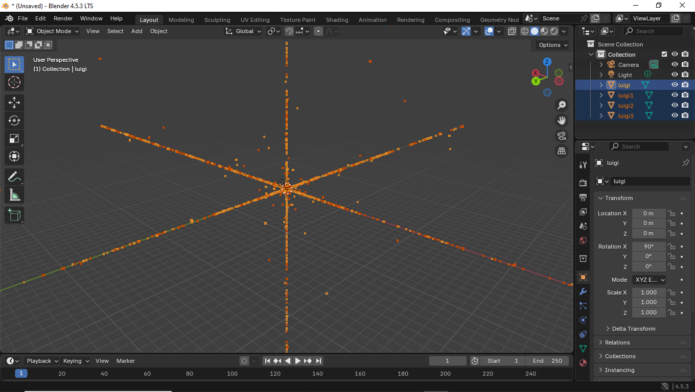

# Mod per DDRMM

After extracting the `.bin` files containing **.mdl** models and converting them into `.obj`, I noticed that in **Blender** they appear as a disorganized sequence of coordinates.  
To work around this issue, I decided to try exporting a 3D model with **the same number of vertices** into an `.obj`, then converting that file back into a `.bin` and adding it to the game files.

---

## Preview

